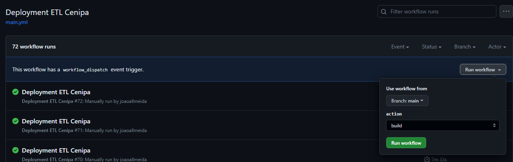
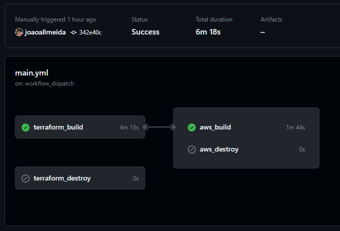
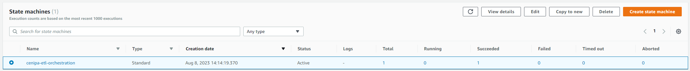
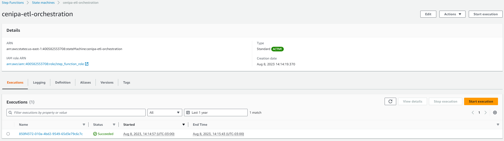
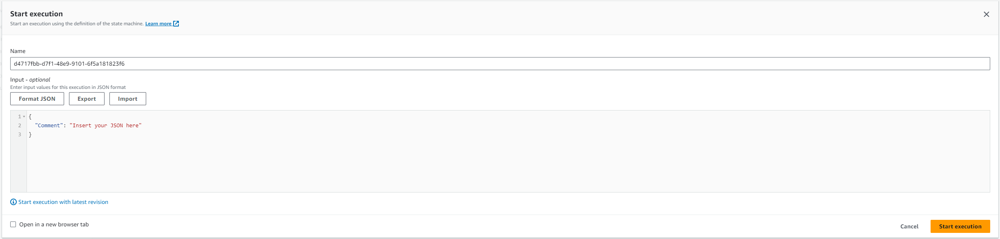
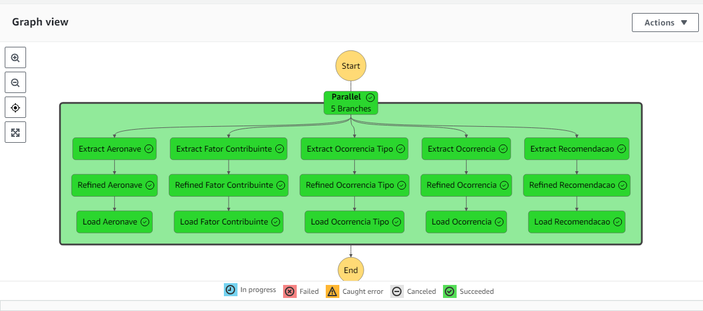
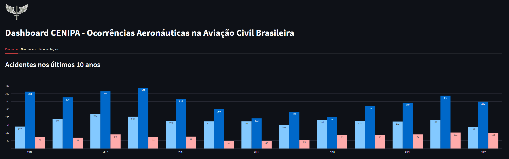
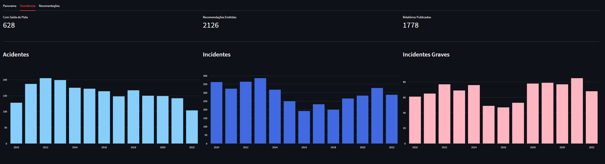
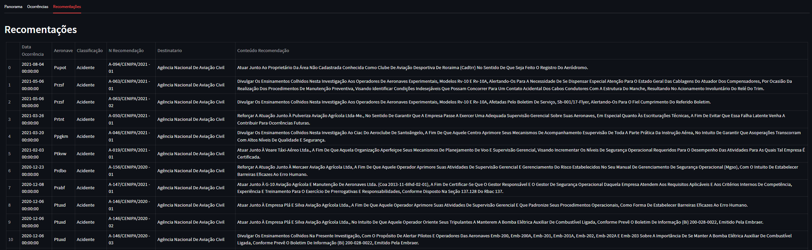

# CENIPA ETL Pipeline
## Overview

Com o objetivo de aprimorar minhas habilidades em construção de ETL de dados e explorar novas ferramentas e tecnologias de desenvolvimento na área de dados, embarquei em um projeto que utiliza os dados do CENIPA (Centro de Investigação e Prevenção de Acidentes Aeronáuticos). 
Esses dados contêm informações sobre: 

* Ocorrências Aeronáuticas.
* Tipos de ocorrências aeronáuticas
* Aeronaves envolvidas nas ocorrências aeronáuticas
* Fatores contribuintes das ocorrências aeronáuticas
* Recomendações de Segurança emitidas nas investigações de acidentes

Com base nesses dados, todo o projeto foi desenvolvido utilizando a plataforma cloud AWS como infraestrutura principal. Ao longo do processo, foram aproveitadas as seguintes ferramentas da AWS:

* **Lambda Function** - Para processamento serveless.
* **Step Function** - Para orquestração.
* **RDS (MySQL)** - Para processamento analítico
* **Glue Connection** - Para armazenar credencias de acessos ao DB.
* **S3** - Para armazenamento dos dados
* **DynamoDb** - Para armazenamento de logs.
* **ECR** - Para versionamento das lambdas.

No desenvolvimento da Lambda Function, optei pela a linguagem de programação Python onde utilizei as seguintes bibliotecas para a implementação da função:

* **Polars** - Para manipulação de dados.
* **Aws Wrangler** - Para interação com serviços AWS.
* **Connectorx** - Para leitura de tabelas em banco de dados. 

A escolha de utilizacao das bibliotecas foram feitas com base na exploração de novos tecnologias, buscando aprimorar diversos aspectos do projeto tais como: 

1. Performance ao ler grandes arquivos de dados.
2. Melhor interação com os servicos da AWS.
3. Maior velocidade em leitura de dados diretamenta de tabelas vindo do banco de dados.

Para a parte de infraestrutura deste projeto, foi utilizado a ferramenta **Terraform** para contrução e gerenciamento dos serviços AWS. Com o terraform é possivel implementar uma infraestrutura como codigo, facilitando definir toda a infraestrutura necessaria de forma declarativa.  
Desta forma utlizando o terraform é possivel proporcionar uma automatizacao e flexibilidade na utilização de servições AWS.

O projeto faz a utilização do **Github Actions** para realizar o deploy de forma automatizada dos serviçõs *Lambda Function* e *Step Function*.

## Como utilizar - Passo a Passo

### Passo 01
A primeira etapa á ser realizada é a criação do usuario no ambiente AWS. Para registrar-se de forma gratuita acesse este [link](https://aws.amazon.com/pt/free/?all-free-tier.sort-by=item.additionalFields.SortRank&all-free-tier.sort-order=asc&awsf.Free%20Tier%20Types=*all&awsf.Free%20Tier%20Categories=*all) e crie uma conta.

Após a criação da sua conta na AWS, será necessário realizar a criação da *Secret* no GitHub. Para facilitar esse processo, siga atentamente as orientações presentes na documentação sobre [Segredos Criptografados](https://docs.github.com/en/actions/security-guides/encrypted-secrets). Estes segredos devem ser nomeados da seguinte forma:

* **AWS_ACCESS_KEY_ID**
* **AWS_SECRET_ACCESS_KEY**

### Passo 02

Ao finalizar a criação da secret, basta executar o seguinte pipeline para realizar o deploy do projeto: 

* [Deployment ETL Cenipa](https://github.com/joaoallmeida/cenipa-data-project/actions/workflows/main.yml)

Ao executar o workflow, é preciso definir o tipo de ação a ser realizado pelo pipeline:

1. build - Realiza o deploy do projeto dentro do ambiente AWS.
2. destroy - Remove o projeto do ambiente AWS, deletando todos os serviços e recursos.
3. update - Atualiza o código da Lambda Function.

Após selecionar a ação desejada, simplesmente clique em *Run workflow* e aguarde até que o pipeline complete a execução.

### Passo 03

Após a conclusão do pipeline, proceda efetuando o login no console da AWS e acesse o serviço [Step Functions](https://us-east-1.console.aws.amazon.com/states/home?region=us-east-1#/homepage).

Em seguida vá em **State Machines**, e execute a seguinte state machine **cenipa-etl-orchestration**.

Para executar basta clicar no nome **cenipa-etl-orchestration** e ir em *Start Execution*. 

Em seguida em *Start Execution* novamente.

Aguarde o processo finalizar.

### Passo 04

Após a conclusão do processo ETL, para visualizar os dados de forma analítica, acesse o Streamlit Cloud através deste [link](https://cenipa-data-project-c6ehzndn5t9wyvoc49kvdh.streamlit.app/).

O Streamlit Cloud é uma ferramenta de código aberto que permite hospedar gratuitamente os painéis desenvolvidos com o framework Streamlit.

Aqui está uma imagem ilustrativa do painel:

---